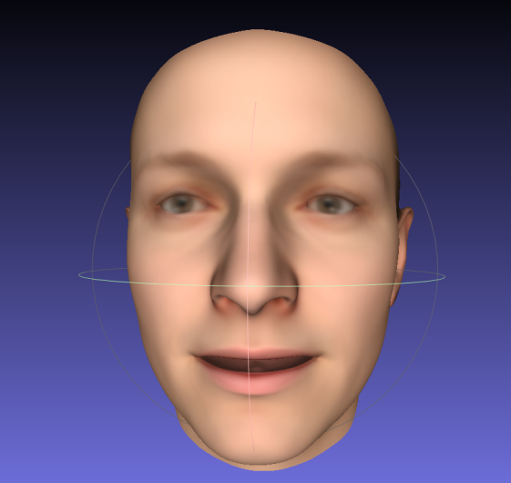

## 3D Morphable Model implemented with python (Cython)

This code is implemented using python (cython), and this implementation was refered with https://github.com/patrikhuber/eos

### Installation

~~~bash
git clone https://github.com/yeongjoonJu/morphable_model.git
cd morphable_model_python
pip install cython
python setup.py build_ext --inplace
~~~

### Example

You can use this code for BFM 2019

~~~bash
# copy Basel Face Model folder to morphable_model_python
python bfm_to_obj.py
~~~

You can see the generated result through a mesh viewer (ex. MeshLab)

**Results**

